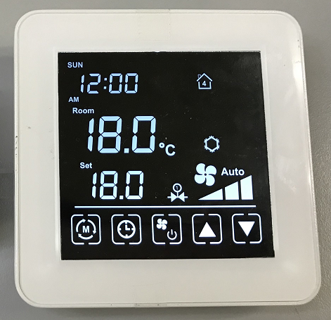

.. Using-Avantec-Thermostats-with-ThingsBoard documentation master file, created by
   sphinx-quickstart on Tue Dec 20 10:31:29 2022.
   You can adapt this file completely to your liking, but it should at least
   contain the root `toctree` directive.

************************************************
Using Avantec Thermostats with ThingsBoard
************************************************

`Avantec`__ provides the latest ``TA65`` Thermostat networking solution. This solution needs to be used with the ``ThingsBoard`` software platform.

.. __: http://www.avantec.com.hk/

.. uml::
   :align: center

   node "\nThingsBoard Server\n" as TBSrv {
   }

   node "\nTA65\n" as TBDev {
   }

   node "\nBrowser\n" as TBApp {
   }

   TBSrv <-down-> TBDev
   TBSrv <-down-> TBApp

* TA65
   The latest series of Thermostat produced by Avantec. The Wi-Fi models include ``TA652FC-W`` and ``TA652FH-W`` (Their firmware ID are ``TA652FC-W-TB`` and ``TA652FH-W-TB``).

* ThingsBoard
   `ThingsBoard`__ is an open-source IoT platform that enables rapid development, management and scaling of IoT projects. Their goal is to provide the out-of-the-box IoT cloud or on-premises solution that will enable server-side infrastructure for your IoT applications. 

   ThingsBoard includes ``ThingsBoard CE (Community Edition)`` and ``ThingsBoard PE (Professional Edition)``. **ThingsBoard CE is 100% Open source and IT'S FREE**. 
   
   *When we developed ``TA652FC-W`` and ``TA652FH-W`` Thermostat, we used ThingsBoard CE.*

.. __: https://thingsboard.io/

.. You can find out more about our all the :doc:`/features` in these pages.

.. toctree::
   :maxdepth: 2
   :caption: First steps

   /intro/get-started

.. toctree::
   :maxdepth: 4
   :caption: ThingsBoard

   Overview </thingsboard/thingsboard-overview>
   Installation </thingsboard/thingsboard-install>
   Customize </thingsboard/thingsboard-customization>
   MQTT Device API </thingsboard/thingsboard-mqtt-device-api>

.. toctree::
   :maxdepth: 4
   :caption: TA652FC-W Wi-Fi Thermostat

   Specifications </device/ta652fc-w/ta652fc-w-specifications>
   Add to ThingsBoard </device/ta652fc-w/add-ta652fc-w-to-thingsboard>
   Connect to ThingsBoard </device/ta652fc-w/connect-ta652fc-w-to-thingsboard>
   Demo Dashboard </device/ta652fc-w/ta652fc-w-demo-dashboard-usage>
   MQTT API </device/ta652fc-w/ta652fc-w-mqtt-api>

.. toctree::
   :maxdepth: 4
   :caption: TA652FH-W Wi-Fi Thermostat

   Specifications </device/ta652fh-w/ta652fh-w-specifications>

.. toctree::
   :maxdepth: 2
   :caption: About

   copyright
   avantec

Indices and tables
==================

* :ref:`genindex`
* :ref:`search`

.. * :ref:`modindex`
