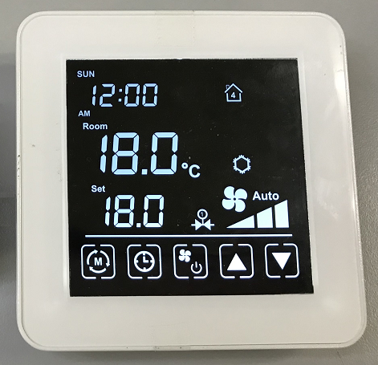

.. Using-Avantec-Thermostat-with-ThingsBoard documentation master file, created by
   sphinx-quickstart on Tue Dec 20 10:31:29 2022.
   You can adapt this file completely to your liking, but it should at least
   contain the root `toctree` directive.

Using TA65 Thermostat with ThingsBoard
======================================

`Avantec`__ provides the latest ``TA65`` Thermostat networking solution. This solution needs to be used with the ``ThingsBoard`` software platform.

.. __: http://www.avantec.com.hk/

.. uml::
   :align: center

   node "\nThingsBoard Server\n" as TBSrv {
   }

   node "\nTA65\n" as TBDev {
   }

   node "\nBrowser\n" as TBApp {
   }

   TBSrv <-down-> TBDev
   TBSrv <-down-> TBApp

* TA65
   The latest series of Thermostat produced by Avantec. The Wi-Fi models include ``TA65-FC`` and ``TA65-FH`` (Their firmware ID are ``TA65-FC-TB`` and ``TA65-FH-TB``).

* ThingsBoard
   `ThingsBoard`__ is an open-source IoT platform that enables rapid development, management and scaling of IoT projects. Their goal is to provide the out-of-the-box IoT cloud or on-premises solution that will enable server-side infrastructure for your IoT applications. 

   ThingsBoard includes ``ThingsBoard CE (Community Edition)`` and ``ThingsBoard PE (Professional Edition)``。**ThingsBoard CE is 100% Open source and IT'S FREE**. 
   
   *When we developed TA65 Thermostat, we used ThingsBoard CE.*

.. __: https://thingsboard.io/

.. You can find out more about our all the :doc:`/features` in these pages.

.. toctree::
   :maxdepth: 2
   :caption: First steps

   /intro/get-started
   /intro/add-ta65-to-thingsboard
   /intro/connect-ta65-to-thingsboard

.. toctree::
   :maxdepth: 3
   :caption: Usage

   ThingsBoard </usage/thingsboard-usage>
   TA65-FC Wi-Fi Thermostat  </usage/ta65-fc-manual>
   TA65-FH Wi-Fi Thermostat  </usage/ta65-fh-manual>
   Avantec Thermostat Dashboard </usage/avantec-dashboard-usage>

.. toctree::
   :maxdepth: 2
   :caption: Customization

   /customize/customization

.. toctree::
   :maxdepth: 4
   :caption: Protocol

   ThingsBoard MQTT API </protocol/thingsboard-mqtt-api>
   TA65-TBMQTT API </protocol/ta65-mqtt-api>

.. toctree::
   :maxdepth: 2
   :caption: About

   copyright
   avantec

Indices and tables
==================

* :ref:`genindex`
* :ref:`search`

.. * :ref:`modindex`
