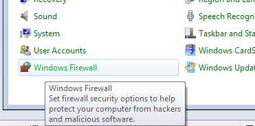
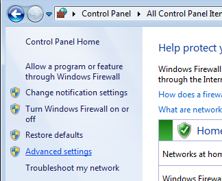
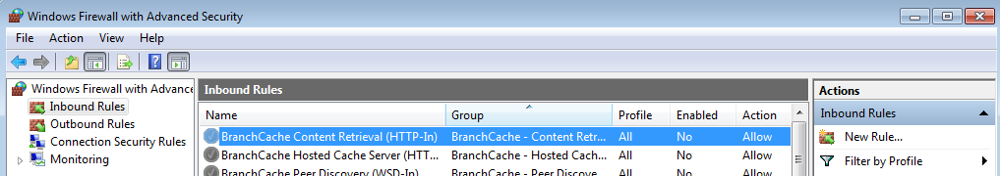
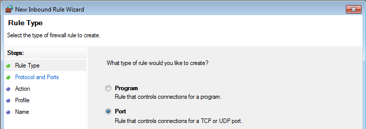
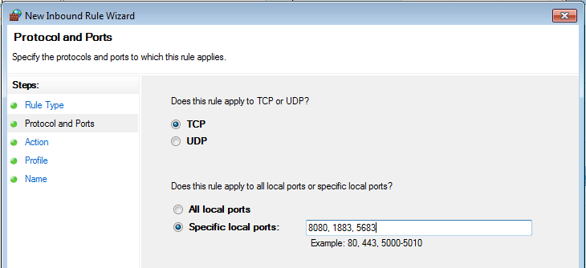
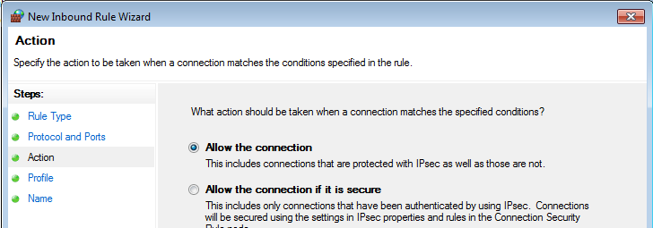
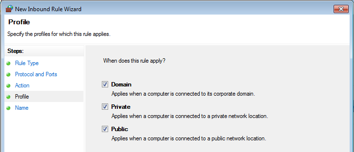
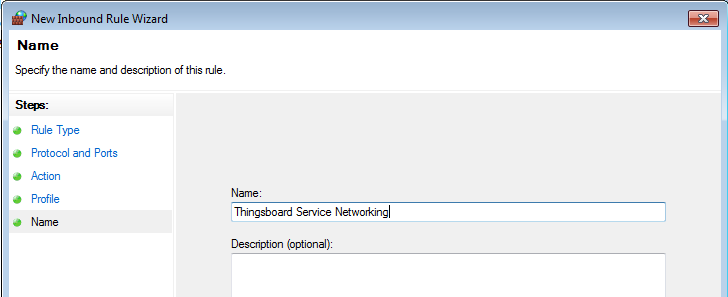

Installing ThingsBoard CE on Windows
==========================================

This article from `ThingsBoard`__, has been made some cuts.

.. __: https://github.com/thingsboard/thingsboard.github.io

.. tip::

   In this article, We use **ThingsBoard CE V3.0.1**, a **PostgreSQL** database, and the **In Memory Message Queue Service**. To use other versions of ThingsBoard, other databases, or other message queue services, refer to `here`__.

.. __: https://thingsboard.io/docs/user-guide/install/windows/

Prerequisites
-------------

This guide describes how to install ThingsBoard on a Windows machine. Instructions below are provided for Windows 10/8.1/8/7 32-bit/64-bit. Hardware requirements depend on chosen database and amount of devices connected to the system. To run ThingsBoard and PostgreSQL on a single machine you will need at least 2Gb of RAM. To run ThingsBoard and Cassandra on a single machine you will need at least 8Gb of RAM.

Step 1. Install Java 8 (OpenJDK)
--------------------------------

ThingsBoard service is running on Java 8. Follow this instructions to install OpenJDK 8.

- Visit `Open JDK Download Page`__ to download latest **OpenJDK 8 (LTS)** MSI package.
- Run the downloaded MSI package and follow the instructions. Make sure you have selected “**Add to PATH**” and “**Set JAVA_HOME variable**” options to “Will be installed on local hard drive” state.

.. __: https://adoptopenjdk.net/index.html

You can check the installation using the following command (using Command Prompt)::

   java -version

Expected command output is::

   C:\Users\User>java -version
   openjdk version "1.8.0_212"
   OpenJDK Runtime Environment (AdoptOpenJDK)(build 1.8.0_212-b04)
   OpenJDK 64-Bit Server VM (AdoptOpenJDK)(build 25.212-b04, mixed mode)

Step 2. ThingsBoard service installation
----------------------------------------

Download and extract the package::

   https://github.com/thingsboard/thingsboard/releases/download/v3.0.1/thingsboard-windows-3.0.1.zip

.. tip::

   We assume you have extracted ThingsBoard package to default location: *C:\\Program Files (x86)\\thingsboard*

Step 3. Configure ThingsBoard database
--------------------------------------

ThingsBoard is able to use SQL or hybrid database approach. See corresponding architecture `page`__ for more details.

.. __: https://thingsboard.io/docs/reference/#sql-vs-nosql-vs-hybrid-database-approach

::

   PostgreSQL
   (recommended for < 5K msg/sec)

.. tip::

   ThingsBoard team recommends to use PostgreSQL for development and production environments with reasonable load (< 5000 msg/sec). Many cloud vendors support managed PostgreSQL servers which is a cost-effective solution for most of ThingsBoard instances.

PostgreSQL Installation
>>>>>>>>>>>>>>>>>>>>>>>

Download the installation file (PostgreSQL 11.7 or newer releases) `here`__ and follow the installation instructions.

.. __: https://www.enterprisedb.com/downloads/postgres-postgresql-downloads#windows

During PostgreSQL installation, you will be prompted for superuser (postgres) password. Don’t forget this password. It will be used later. For simplicity, we will substitute it with “postgres”.

Create ThingsBoard Database
>>>>>>>>>>>>>>>>>>>>>>>>>>>

Once installed, launch the “pgAdmin” software and login as superuser (postgres). Open your server and create database “thingsboard” with owner “postgres”.

ThingsBoard Configuration
>>>>>>>>>>>>>>>>>>>>>>>>>

In case you have specified the PostgreSQL superuser password as “postgres”, you can skip this step.

Open the Notepad or other editor as administrator user (right click on the app icon and select “Run as administrator”).
Open the following file for editing (select “All Files” instead of “Text Documents” in file choosing dialog, the encoding is UTF-8)::

   C:\Program Files (x86)\thingsboard\conf\thingsboard.yml

and locate “**# SQL DAO Configuration**” block. Don’t forget to replace “**postgres**” with your real postgres user password:

.. code:: YAML

   # SQL DAO Configuration
   spring:
     data:
       jpa:
         repositories:
           enabled: "true"
     jpa:
       open-in-view: "false"
       hibernate:
         ddl-auto: "none"
       database-platform: "${SPRING_JPA_DATABASE_PLATFORM:org.hibernate.dialect.PostgreSQLDialect}"
     datasource:
       driverClassName: "${SPRING_DRIVER_CLASS_NAME:org.postgresql.Driver}"
       url: "${SPRING_DATASOURCE_URL:jdbc:postgresql://localhost:5432/thingsboard}"
       username: "${SPRING_DATASOURCE_USERNAME:postgres}"
       password: "${SPRING_DATASOURCE_PASSWORD:YOUR_POSTGRES_PASSWORD_HERE}"
       hikari:
         maximumPoolSize: "${SPRING_DATASOURCE_MAXIMUM_POOL_SIZE:5}"

locate “**SQL_POSTGRES_TS_KV_PARTITIONING**” parameter in order to override the default value for timestamp key-value storage partitioning size:

.. code:: YAML

   sql:
     postgres:
       # Specify partitioning size for timestamp key-value storage. Example: DAYS, MONTHS, YEARS, INDEFINITE.
       ts_key_value_partitioning: "${SQL_POSTGRES_TS_KV_PARTITIONING:MONTHS}"

Step 4. Choose ThingsBoard queue service
----------------------------------------

ThingsBoard is able to use various messaging systems/brokers for storing the messages and communication between ThingsBoard services. How to choose the right queue implementation?

- **In Memory** queue implementation is built-in and default. It is useful for development(PoC) environments and is not suitable for production deployments or any sort of cluster deployments.
- **Kafka** is recommended for production deployments. This queue is used on the most of ThingsBoard production environments now. It is useful for both on-prem and private cloud deployments. It is also useful if you like to stay independent from your cloud provider. However, some providers also have managed services for Kafka. See AWS `MSK`__ for example.
- **RabbitMQ** is recommended if you don’t have much load and you already have experience with this messaging system.
- **AWS SQS** is a fully managed message queuing service from AWS. Useful if you plan to deploy ThingsBoard on AWS.
- **Google Pub/Sub** is a fully managed message queuing service from Google. Useful if you plan to deploy ThingsBoard on Google Cloud.
- **Azure Service Bus** is a fully managed message queuing service from Azure. Useful if you plan to deploy ThingsBoard on Azure.

.. __: https://aws.amazon.com/msk/

See corresponding architecture `page`__ and rule engine `page`__ for more details.

.. __: https://thingsboard.io/docs/reference/#message-queues-are-awesome

.. __: https://thingsboard.io/docs/user-guide/rule-engine-2-0/overview/#rule-engine-queue

::

   In Memory
   (built-in and default)

In Memory queue is built-in and enabled by default. No additional configuration steps required.

Step 5. [Optional] Memory update for slow machines (1GB of RAM)
---------------------------------------------------------------

Open the Notepad or other editor as administrator user (right click on the app icon and select “Run as administrator”).
Open the following file for editing (select “All Files” instead of “Text Documents” in file choosing dialog, the encoding is UTF-8)::

  C:\Program Files (x86)\thingsboard\thingsboard.xml

Locate the following lines to the configuration file::

   <startargument>-Xms512m</startargument>
   <startargument>-Xmx1024m</startargument>

and change them to::

   <startargument>-Xms256m</startargument>
   <startargument>-Xmx256m</startargument>

Step 6. Run installation script
-------------------------------

Launch windows shell (Command Prompt) as Administrator. Change directory to your ThingsBoard installation directory.

Execute **install.bat** script to install ThingsBoard as a Windows service (or run “**install.bat –loadDemo**” to install and add demo data). This means it will be automatically started on system startup. Similar, **uninstall.bat** will remove ThingsBoard from Windows services. The output should be similar to this one::

   C:\Program Files (x86)\thingsboard>install.bat --loadDemo
   Detecting Java version installed.
   CurrentVersion 18
   Java 1.8 found!
   Installing thingsboard ...
   ...
   ThingsBoard installed successfully!

Step 7. Start ThingsBoard service
---------------------------------

Now let’s start the ThingsBoard service! Open the command prompt as an Administrator and execute the following command::

   net start thingsboard

Expected output::

   The ThingsBoard Server Application service is starting.
   The ThingsBoard Server Application service was started successfully.

In order to restart the ThingsBoard service you can execute following commands::

   net stop thingsboard
   net start thingsboard

Once started, you will be able to open Web UI using the following link::

   http://localhost:8080/

The following default credentials are available if you have specified –loadDemo during execution of the installation script:

- **Systen Administrator**: sysadmin@thingsboard.org / sysadmin
- **Tenant Administrator**: tenant@thingsboard.org / tenant
- **Customer User**: customer@thingsboard.org / customer

You can always change passwords for each account in account profile page.

.. tip::

   Please allow up to 90 seconds for the Web UI to start. This is applicable only for slow machines with 1-2 CPUs or 1-2 GB RAM.

Troubleshooting
---------------

The log files are located in **logs** folder (“C:\Program Files (x86)\thingsboard\logs” in our case).

The **thingsboard.log** file should contain following line::

   YYYY-MM-DD HH:mm:ss,sss [main] INFO  o.t.s.ThingsboardServerApplication - Started ThingsboardServerApplication in x.xxx seconds (JVM running for x.xxx)

In case of any unclear errors, use general `troubleshooting guide`__.

.. __: https://thingsboard.io/docs/user-guide/troubleshooting/#getting-help

Windows firewall settings
-------------------------

In order to have external access to ThingsBoard Web UI and device connectivity (HTTP, MQTT, CoAP) you need to create a new inbound rule with Windows Firewall with Advanced Security.

- Open “Windows Firewall” from “Control Panel”:

- Click “Advanced settings” on the left panel:

- Select “Inbound Rules” on the left panel, then click “New Rule…” on the right “Actions” panel:

- Now new “New Inbound Rule Wizard” window will open. On the first step “Rule Type” select “Port” option:

- On the “Protocol and Ports” step select “TCP” protocol and enter port list **8080**, **1883**, **5683** in the “Specific local ports” field:

- On the “Action” step leave “Allow the connection” option selected:

- On the “Profile” step select Windows network profiles when to apply this rule:

- Finally, give the name to this rule (for ex. “ThingsBoard Service Networking”) and click “Finish”.

